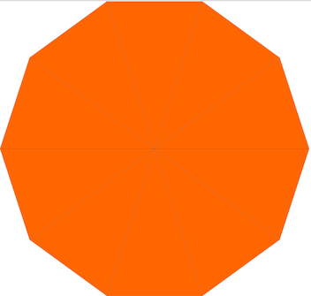
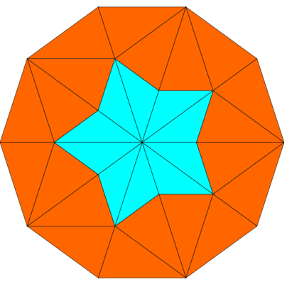
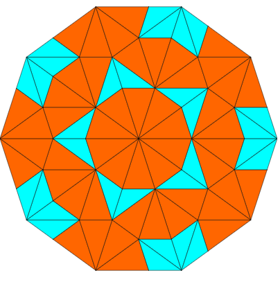
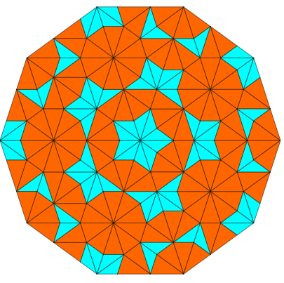
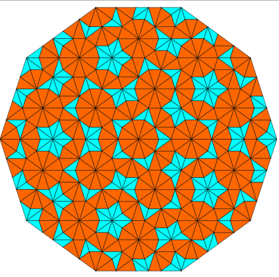
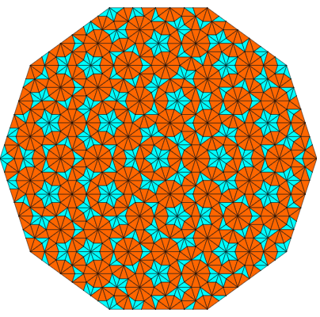
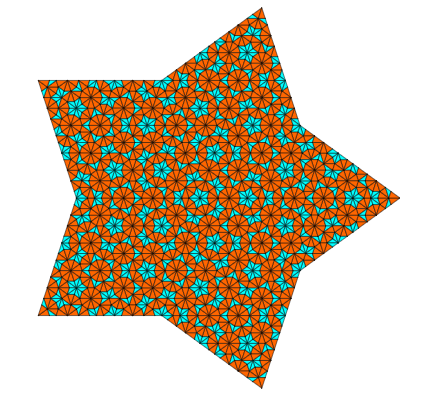

# PenroseGenerator

This script generates SVG files containing Kite and Dart Penrose Tilings.

https://en.wikipedia.org/wiki/Penrose_tiling

## To run
You can run with defaults values: `python penrose.py`

or with own values: `python penrose.py --color1='#fff200' --color2='#3A5AA5' --color_stroke='#3A5AA5' --size=100 --shape='sun' --number=5 --fname demo`

To see all available arguments run with `-h` flag: `python penrose.py -h`

This will generate Penrose tilings of type P2. They have two main initial shapes - [star and sun](https://en.wikipedia.org/wiki/Penrose_tiling#Deflation_for_P2_and_P3_tilings). 

The script will generate `[number of generations]` files. Each will be a successive generation of the tiling.

### Sun Configuration

Here are screenshots of the SVG files generated by: `python penrose.py sun 6 sun_tiling.svg`

Initial configuration:

Generation 1: 

Generation 2:

Generation 3:

Generation 4:

Generation 5: 

### Star configuration

Here is a screenshot of the last SVG file generated by: `python penrose.py star 6 star_tiling.svg`

